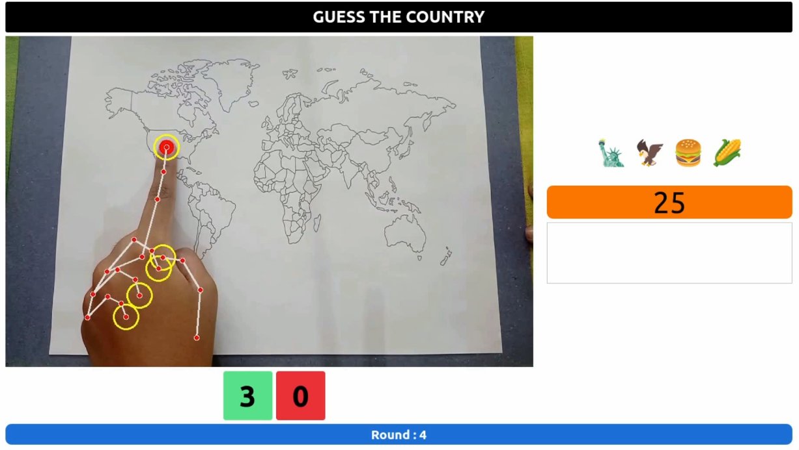

# Google Gemini Demo: "Guess the Country" Game

**Documentation**: A full step-by-step explanation of the game can be found in the [Medium article](https://medium.com/@pamudu1111/guess-the-country-4b983ff36616).

**Trained YOLOv8 Model**: The trained YOLOv8 model used in the game can be downloaded from [this link](https://drive.google.com/drive/folders/1qlYVauHO4wAbJJjtWUP0ugfk9-m4xzD3?usp=sharing).

**Demonstration Video**: [YouTube link](https://www.youtube.com/watch?v=9gTek0wQywc&ab_channel=Pamudu123Ranasinghe).

**Custom Training**: If you want to train a YOLOv8 segmentation model on your data, detailed steps are provided in my article. You can find the code for training in the `Segmentation` folder.

### Steps for run the Game

1. Clone the repository: `git clone https://github.com/pamudu123/guess-the-country.git`
2. Install dependencies: `pip install -r requirements.txt`
4. Run the training script: `python info_window.py`

## Note

**I encourage you to enhance this game**. In my article, I have outlined both the limitations and potential improvements. Feel free to explore and modify the code to suit your specific requirements. I would love to see your creative take on the game. If you develop an engaging and innovative version, feel free to send me a message. 

**Enjoy delving into the 'Guess the Country' game !**

If you come across any challenges or have questions, please refer to the article for guidance or reach out to me.

